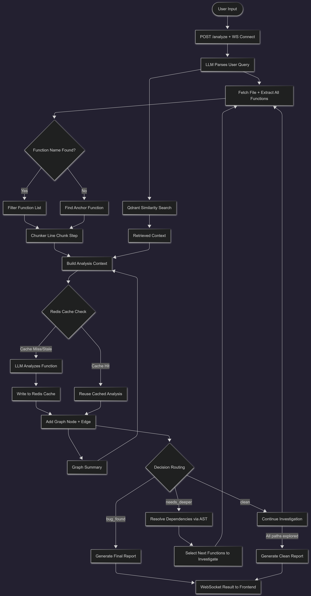

# CodeAssist

> AI-powered repository-aware debugging system that analyzes dependency relationships across files instead of isolated code snippets.


---

## 1. What is CodeAssist?

CodeAssist is a repository-aware AI debugging platform. Give it a GitHub repo, a file path, and a plain-English bug description — it traces the actual dependency chain and returns a structured root-cause report.

- **Cross-file knowledge graph** — an AST-based engine builds a function-call graph across files, so the LLM reasons with context accumulated across every path it has already investigated, not just the one function in front of it
- **Dual-path retrieval** — CodeBERT resolves the traversal entry point (anchor-function + line-chunk matching), while Qdrant retrieves top-k similar bug patterns to ground the LLM's hypothesis before it goes deep
- **AST-hash caching** — Redis caches LLM analysis per structural hash, so unchanged code across traversal branches is never re-analyzed
- **AI observability** — every traversal step, cache hit/miss, and routing decision streams live to the frontend over WebSocket, so the reasoning is visible in real time, not just the final answer
- **Lightweight deployment** — embedding generation runs on a separate microservice, cutting the backend's Docker image from 2 GB to 500 MB

---

## 2. Demo

> Enter a GitHub repository URL, a Python file path, and describe the issue in plain English. CodeAssist handles entry-point discovery, traversal, retrieval, analysis, and report generation automatically — streaming progress live over WebSocket as it works.

---

## 3. Tech Stack

| Layer               | Technology              |
| ------------------- | ------------------------ |
| Frontend            | React, TypeScript, Vite |
| Backend             | FastAPI, Python 3.12     |
| Real-Time Streaming | WebSockets                |
| LLM                 | Gemini 2.5 Flash          |
| Embeddings          | CodeBERT                  |
| Vector Database     | Qdrant Cloud               |
| Cache               | Upstash Redis              |
| Deployment          | Docker, Render, Vercel     |
| Embedding Service   | Hugging Face Spaces        |

---

## 4. Architecture & Flow Diagram



---

## 5. API Endpoints

| Method | Endpoint       | Description                 |
| ------ | -------------- | ---------------------------- |
| `POST` | `/analyze`     | Submit analysis request      |
| `WS`   | `/ws/{job_id}` | Real-time streamed analysis  |
| `GET`  | `/health`      | Backend service health       |
| `GET`  | `/cache/stats` | Redis cache statistics       |
| `POST` | `/cache/clear` | Flush Redis cache            |

### WebSocket Message Types

```json
{ "type": "spinner", "message": "Fetching repository..." }

{ "type": "log", "message": "Traversing compute_average → compute_sum" }

{
  "type": "result",
  "data": {
    "status": "bug_found",
    "report": "...",
    "graph": {}
  }
}

{ "type": "error", "detail": "Repository fetch failed" }
```

---

## 6. Getting Started

### Prerequisites

- Python 3.12+
- Node.js 18+
- Docker
- Gemini API key
- Qdrant Cloud account
- Upstash Redis account

### Backend Setup

```bash
cd backend

python -m venv venv

# Windows
venv\Scripts\activate

# Linux / Mac
source venv/bin/activate

pip install -r requirements.txt
```

Create `.env` inside `backend/`:

```env
GEMINI_API_KEY=your_key

QDRANT_URL=your_qdrant_url
QDRANT_API_KEY=your_qdrant_api_key

REDIS_HOST=your_host
REDIS_PORT=6379
REDIS_PASSWORD=your_password

EMBEDDER_URL=deployed_microservice_url

MAX_DEPTH=5
TOP_K=3
```

Run backend:

```bash
uvicorn app.main:app --reload
```

### Frontend Setup

```bash
cd frontend

npm install
npm run dev
```

Create `.env` inside `frontend/`:

```env
VITE_API_BASE=http://localhost:8000
```

### Docker

```bash
cd backend

docker build -t codeassist_backend .

docker run -p 8000:8000 \
  -e GEMINI_API_KEY=your_key \
  -e QDRANT_URL=your_url \
  -e QDRANT_API_KEY=your_key \
  -e REDIS_HOST=your_host \
  -e REDIS_PORT=6379 \
  -e REDIS_PASSWORD=your_password \
  codeassist_backend
```

---

## 7. Roadmap

- [ ] Custom bug-pattern summary corpus — LLM-generated root-cause / trigger / fix-strategy summaries over Defectors (and similar) data, replacing raw code-similarity retrieval entirely
- [ ] Multi-language support (JavaScript, Java, Go)
- [ ] Smarter traversal with confidence-based branch pruning and early stopping
- [ ] Multi-root-cause detection across independent dependency paths
- [ ] Improved Top-K entry-point retrieval, blending anchor confidence with bug-pattern similarity
- [ ] Redis job-ID storage migration from in-memory to TTL-based Redis expiry

---

## Author

B Sri Ram
